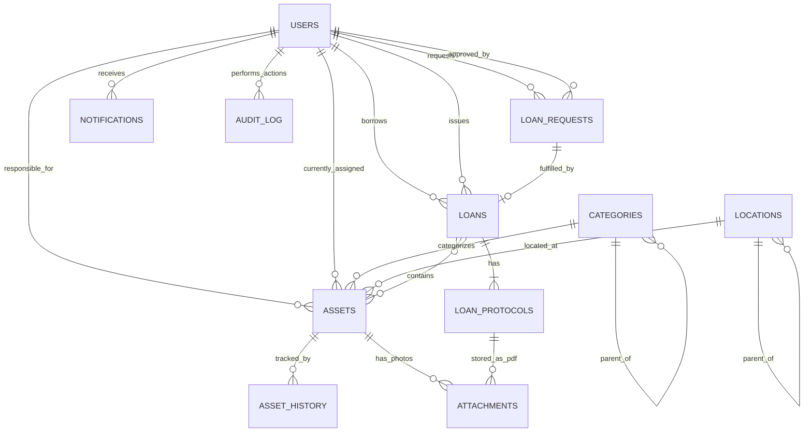

# Dátový model

|                           |                           |
| ------------------------- | ------------------------- |
| **Verzia**                | 0.1 (draft)               |
| **Status**                | Návrh na pripomienkovanie |
| **Posledná aktualizácia** | máj 2026                  |
| **Databáza**              | MongoDB Atlas (Cloud)     |

Tento dokument popisuje dátový model systému SFZ Asset Management. Všetky kolekcie sú v MongoDB; schémy sú definované pomocou **Zod** v `packages/shared-types/` a vynucované na úrovni aplikačnej vrstvy (NestJS).

## Obsah

1. [Princípy](#1-princípy)
2. [Prehľad kolekcií](#2-prehľad-kolekcií)
3. [Schémy](#3-schémy)
4. [Vzťahy medzi kolekciami](#4-vzťahy-medzi-kolekciami)
5. [Indexy](#5-indexy)
6. [Audit a retencia](#6-audit-a-retencia)
7. [Migrácie a verzovanie schém](#7-migrácie-a-verzovanie-schém)

---

## 1. Princípy

- **MongoDB ako document store** – využívame flexibilitu pre kategóriovo špecifické atribúty (`customFields` v `assets`).
- **Prístup k DB:** natívny `mongodb` driver + Repository pattern, **bez Mongoose** – viď [ADR-0005](../decisions/0005-mongo-native-driver.md).
- **Validácia na aplikačnej vrstve** – Zod schémy ako single source of truth, generujú TypeScript typy aj JSON Schema.
- **JSON Schema validácia v Mongo** – pre všetky kolekcie nastavíme `$jsonSchema` validator na strane Mongo (vygenerovaný zo Zod cez `zod-to-json-schema`) ako defense in depth.
- **Soft-delete namiesto hard-delete** – záznamy sa nemažú, len sa označia `deletedAt`. Audit log a história zostávajú.
- **Append-only pre audit** – `audit_log` a `asset_history` sú write-once, nikdy sa neupravujú ani neodstraňujú.
- **ObjectId pre \_id** – štandardný MongoDB ObjectId pre primárne kľúče, plus business identifikátory (`inventoryNumber`, `qrCode`).
- **Časové pečiatky všade** – každý dokument má `createdAt`, `updatedAt`, voliteľne `deletedAt`.
- **Referencie cez ObjectId** – nepoužívame Mongo DBRef, len `ObjectId` + manuálne resolve.

---

## 2. Prehľad kolekcií

| Kolekcia         | Účel                                         | Veľkosť (odhad) | Rast         |
| ---------------- | -------------------------------------------- | --------------- | ------------ |
| `users`          | Používatelia (interní + externí)             | ~500            | nízky        |
| `assets`         | Karty majetku                                | ~20 000         | stredný      |
| `categories`     | Číselník kategórií + definícia custom fields | ~50             | nízky        |
| `locations`      | Číselník lokalít                             | ~30             | nízky        |
| `loan_requests`  | Žiadosti o vypožičanie                       | ~30 000/rok     | vysoký       |
| `loans`          | Aktívne a historické zápožičky               | ~30 000/rok     | vysoký       |
| `loan_protocols` | PDF protokoly + podpisy                      | ~60 000/rok     | vysoký       |
| `asset_history`  | Chronológia pohybov per asset                | ~100 000/rok    | vysoký       |
| `audit_log`      | Systémový audit log (append-only)            | ~500 000/rok    | veľmi vysoký |
| `notifications`  | Fronta a história notifikácií                | ~100 000/rok    | vysoký       |
| `attachments`    | Metadata pre prílohy (binárne dáta v S3)     | ~50 000         | stredný      |
| `system_config`  | Systémové nastavenia, feature flags          | ~50             | nízky        |

---

## 3. Schémy

### 3.1 `users`

Používatelia systému. Interní (SFZ zamestnanci cez Entra ID) aj externí (tréneri klubov, partneri).

```typescript
{
  _id: ObjectId,

  // Identifikácia
  email: string,                    // unique, normalizovaný (lowercase)
  displayName: string,
  firstName: string,
  lastName: string,

  // Typ účtu
  type: "internal" | "external",

  // Entra ID prepojenie (len pre internal)
  entraId: {
    oid: string,                    // Object ID v Entra ID (unique)
    upn: string,                    // User Principal Name
    tenantId: string,
  } | null,

  // Pre externých
  externalAccount: {
    organization: string,           // názov klubu/organizácie
    contactPhone: string | null,
    expiresAt: ISODate | null,      // dátum exspirácie účtu
    createdByUserId: ObjectId,      // kto externého vytvoril
  } | null,

  // Roly
  roles: ("admin" | "asset_manager" | "team_manager" | "employee" | "external")[],

  // Pre asset_manager – obmedzenie na kategórie/lokality
  managerScope: {
    categoryIds: ObjectId[],        // môže spravovať len tieto kategórie
    locationIds: ObjectId[],        // a/alebo tieto lokality
  } | null,

  // Organizačné údaje (sync z Entra ID / Graph API)
  organization: {
    department: string | null,
    jobTitle: string | null,
    managerId: ObjectId | null,     // FK na users
  },

  // Preferencie
  preferences: {
    locale: "sk" | "en",
    notifications: {
      email: boolean,
      inApp: boolean,
      digestFrequency: "off" | "daily" | "weekly",
    },
  },

  // Stav
  status: "active" | "suspended" | "deactivated",
  lastLoginAt: ISODate | null,

  // Časové pečiatky
  createdAt: ISODate,
  updatedAt: ISODate,
  deletedAt: ISODate | null,
}
```

**Pravidlá:**

- Ak `type = "internal"`, `entraId` je povinné a `externalAccount` je `null`.
- Ak `type = "external"`, `externalAccount` je povinné a `entraId` je `null`.
- `email` musí byť unique naprieč všetkými používateľmi (internými aj externými).

---

### 3.2 `assets`

Hlavná entita – karta majetku.

```typescript
{
  _id: ObjectId,

  // Identifikácia
  inventoryNumber: string,          // unique, formát "SFZ-2026-00001"
  externalInventoryNumber: string | null, // ak existuje vo starej evidencii
  qrCode: string,                   // unique, krátky hash URL pre sken
  barcodeEan: string | null,        // voliteľný EAN/Code128 pre čiarový kód

  // Základné údaje
  name: string,
  description: string | null,
  categoryId: ObjectId,             // FK -> categories
  subcategoryId: ObjectId | null,
  manufacturer: string | null,
  model: string | null,
  serialNumber: string | null,

  // Stav a lokalita
  status: AssetStatus,              // viď enum nižšie
  locationId: ObjectId,             // FK -> locations (aktuálna)
  assignedToUserId: ObjectId | null,// FK -> users (kto aktuálne má)
  responsibleUserId: ObjectId | null,// správca tejto konkrétnej položky (zodpovedná osoba)

  // Kategóriovo špecifické atribúty (flexibilný dictionary)
  // Schéma je definovaná v `categories[].customFieldsSchema`
  customFields: {
    [fieldName: string]: string | number | boolean | ISODate | null,
  },

  // Obstaranie (informatívne, NIE účtovne)
  acquisition: {
    date: ISODate | null,
    price: { amount: number, currency: "EUR" } | null,
    supplier: string | null,
    purchaseOrderNumber: string | null,
    warrantyUntil: ISODate | null,
  },

  // Tagy
  tags: string[],

  // Prílohy
  primaryPhotoId: ObjectId | null,  // FK -> attachments
  photoIds: ObjectId[],             // ďalšie fotky
  documentIds: ObjectId[],          // manuály, faktúry, dokumenty

  // Poznámky
  notes: string | null,

  // Vyradenie
  disposal: {
    date: ISODate,
    reason: string,                 // povinné pri vyradení
    disposedByUserId: ObjectId,
  } | null,

  // Časové pečiatky
  createdAt: ISODate,
  createdByUserId: ObjectId,
  updatedAt: ISODate,
  updatedByUserId: ObjectId,
  deletedAt: ISODate | null,        // soft-delete (rare, len pre chybné záznamy)

  // Verzia schémy pre prípadné migrácie
  schemaVersion: number,            // start at 1
}
```

**Enum `AssetStatus`:**

```typescript
type AssetStatus =
  | 'available' // K dispozícii
  | 'reserved' // Rezervované (žiadosť schválená, nie prevzaté)
  | 'borrowed' // Vypožičané
  | 'in_service' // V servise / oprave
  | 'disposed' // Vyradené (terminal)
  | 'lost'; // Stratené
```

---

### 3.3 `categories`

Číselník kategórií majetku s definíciou custom fields.

```typescript
{
  _id: ObjectId,
  code: string,                     // unique, machine-friendly (napr. "notebook")
  name: { sk: string, en: string },
  description: string | null,
  parentCategoryId: ObjectId | null,// pre podkategórie
  icon: string | null,              // lucide icon name

  // Definícia custom fields pre túto kategóriu
  customFieldsSchema: {
    fieldName: string,              // machine name, napr. "ram_gb"
    label: { sk: string, en: string },
    type: "text" | "number" | "boolean" | "date" | "select",
    required: boolean,
    defaultValue: any | null,
    options: string[] | null,       // pre type "select"
    validation: {
      min?: number,
      max?: number,
      pattern?: string,             // regex
    } | null,
    order: number,                  // poradie zobrazenia
  }[],

  // Prefix pre inventárne čísla v tejto kategórii (voliteľné)
  inventoryNumberPrefix: string | null,  // napr. "NB" -> "SFZ-2026-NB-00001"

  active: boolean,                  // možnosť zneaktívnenia bez zmazania

  createdAt: ISODate,
  updatedAt: ISODate,
}
```

---

### 3.4 `locations`

Číselník lokalít – centrála, regionálne zväzy, sklady, etc.

```typescript
{
  _id: ObjectId,
  code: string,                     // unique, napr. "centrala", "ba-sklad"
  name: string,
  address: {
    street: string | null,
    city: string | null,
    postalCode: string | null,
    country: string,                // ISO 3166-1 alpha-2
  } | null,
  parentLocationId: ObjectId | null,// pre hierarchiu (centrála -> miestnosť 203)
  type: "office" | "warehouse" | "training_facility" | "external" | "other",

  managerUserId: ObjectId | null,   // hlavná zodpovedná osoba

  active: boolean,
  createdAt: ISODate,
  updatedAt: ISODate,
}
```

---

### 3.5 `loan_requests`

Žiadosti o vypožičanie (pred fyzickým prevzatím).

```typescript
{
  _id: ObjectId,
  requestNumber: string,            // unique, "REQ-2026-00001"

  // Žiadateľ
  requesterId: ObjectId,            // FK -> users
  onBehalfOfUserId: ObjectId | null,// ak manažér žiada za podriadeného

  // Položky
  items: {
    assetId: ObjectId,              // FK -> assets
    quantity: number,               // pre future-proofing (default 1, zatiaľ vždy 1)
  }[],

  // Časové parametre
  requestedFrom: ISODate,
  requestedUntil: ISODate,
  purpose: string,                  // odôvodnenie

  // Stav workflow
  status: "pending" | "approved" | "rejected" | "cancelled" | "fulfilled",

  // Schválenie
  approval: {
    approverId: ObjectId,           // FK -> users
    decidedAt: ISODate,
    comment: string | null,
  } | null,

  // Ak fulfilled, odkaz na loan
  loanId: ObjectId | null,          // FK -> loans

  createdAt: ISODate,
  updatedAt: ISODate,
}
```

---

### 3.6 `loans`

Aktívne a historické zápožičky.

```typescript
{
  _id: ObjectId,
  loanNumber: string,               // unique, "LOAN-2026-00001"

  // Z akej žiadosti vznikla (null pre rýchle vypožičanie)
  loanRequestId: ObjectId | null,

  // Vypožičiavateľ
  borrowerId: ObjectId,             // FK -> users
  issuedByUserId: ObjectId,         // FK -> users (Správca, ktorý vydal)

  // Položky (kópia v okamihu vypožičania – immutable snapshot)
  items: {
    assetId: ObjectId,
    inventoryNumber: string,        // snapshot pre prípad zmeny v assets
    name: string,                   // snapshot
    returnedAt: ISODate | null,     // pre čiastočné vrátenie
    returnCondition: ReturnCondition | null,
    returnNotes: string | null,
    returnedByUserId: ObjectId | null, // kto prevzal vrátenie
  }[],

  // Časové parametre
  borrowedAt: ISODate,
  dueAt: ISODate,
  returnedAt: ISODate | null,       // ak všetky items vrátené

  // Stav
  status: "active" | "partially_returned" | "returned" | "overdue",

  // Protokoly
  pickupProtocolId: ObjectId,       // FK -> loan_protocols (vždy existuje)
  returnProtocolIds: ObjectId[],    // FK -> loan_protocols (môže byť viacero pre čiastočné vrátenia)

  // Predĺženia (history)
  extensions: {
    requestedAt: ISODate,
    requestedByUserId: ObjectId,
    newDueAt: ISODate,
    approvedByUserId: ObjectId,
    approvedAt: ISODate,
    reason: string | null,
  }[],

  // Spôsob vypožičania
  loanType: "standard" | "quick" | "bulk", // štandardná / rýchla / hromadná

  notes: string | null,

  createdAt: ISODate,
  updatedAt: ISODate,
}

type ReturnCondition = "ok" | "damaged" | "incomplete" | "lost";
```

---

### 3.7 `loan_protocols`

PDF protokoly o prevzatí a vrátení – metadata. Samotné PDF je v object storage.

```typescript
{
  _id: ObjectId,
  loanId: ObjectId,                 // FK -> loans
  type: "pickup" | "return" | "partial_return",
  protocolNumber: string,           // unique

  // Súbor v object storage
  storageKey: string,               // S3 key pre PDF
  fileSize: number,
  contentHash: string,              // SHA-256 pre integrity check

  // Podpisy
  signatures: {
    signerUserId: ObjectId,
    signerRole: "borrower" | "issuer",
    signedAt: ISODate,
    method: "click" | "drawn",
    signatureImageStorageKey: string | null, // pre nakreslený podpis
    ipAddress: string,
    userAgent: string,
  }[],

  // Stav podpisovania
  status: "pending_signatures" | "completed",

  // Snapshot dát pre právnu integritu
  snapshot: {
    items: Array<{ inventoryNumber: string, name: string, condition?: string }>,
    borrower: { displayName: string, email: string },
    issuer: { displayName: string, email: string },
    location: string,
    timestamp: ISODate,
  },

  createdAt: ISODate,
}
```

---

### 3.8 `asset_history`

Append-only chronológia pohybov per asset.

```typescript
{
  _id: ObjectId,
  assetId: ObjectId,                // FK -> assets

  eventType:
    | "created"
    | "updated"
    | "status_changed"
    | "location_changed"
    | "assigned"
    | "unassigned"
    | "borrowed"
    | "returned"
    | "service_started"
    | "service_ended"
    | "disposed"
    | "lost"
    | "found",

  // Diff (čo sa zmenilo)
  changes: {
    field: string,
    oldValue: any,
    newValue: any,
  }[],

  // Kontext
  triggeredByUserId: ObjectId | null,  // null pre systémové eventy
  relatedLoanId: ObjectId | null,
  relatedRequestId: ObjectId | null,
  notes: string | null,

  timestamp: ISODate,                  // immutable
}
```

---

### 3.9 `audit_log`

Systémový audit log – append-only, nezmazateľný.

```typescript
{
  _id: ObjectId,

  // Kto, kedy
  userId: ObjectId | null,           // null pre anonymné akcie (login pokusy)
  userEmail: string | null,          // snapshot pre prípad zmazania účtu
  timestamp: ISODate,

  // Kontext request-u
  requestId: string,                 // correlation ID
  ipAddress: string,
  userAgent: string,

  // Akcia
  action: string,                    // napr. "asset.created", "loan.approved", "user.role_changed"
  entityType: string,                // "asset", "loan", "user", ...
  entityId: ObjectId | null,

  // Detaily
  changes: {
    field: string,
    oldValue: any,
    newValue: any,
  }[] | null,

  // Výsledok
  result: "success" | "failure",
  errorMessage: string | null,
}
```

**Retencia:** 5 rokov. Po uplynutí sa staré záznamy archivujú do object storage (CSV/JSON gzip) a z Mongo sa odstránia (cron job).

---

### 3.10 `notifications`

Fronta a história notifikácií.

```typescript
{
  _id: ObjectId,

  // Príjemca
  recipientUserId: ObjectId,

  // Obsah
  type: NotificationType,
  title: { sk: string, en: string },
  body: { sk: string, en: string },
  actionUrl: string | null,          // odkaz pre kliknutie

  // Súvisiace entity
  relatedEntities: {
    type: string,
    id: ObjectId,
  }[],

  // Kanály a stav doručenia
  channels: {
    inApp: {
      enabled: boolean,
      readAt: ISODate | null,
    },
    email: {
      enabled: boolean,
      sentAt: ISODate | null,
      failureReason: string | null,
    },
    teams: {
      enabled: boolean,
      sentAt: ISODate | null,
    },
  },

  // Priorita
  priority: "low" | "normal" | "high" | "critical",

  createdAt: ISODate,
  expiresAt: ISODate | null,         // automatické zmazanie po expirácii (TTL index)
}

type NotificationType =
  | "loan_request_new"
  | "loan_request_approved"
  | "loan_request_rejected"
  | "loan_due_reminder_3d"
  | "loan_due_reminder_1d"
  | "loan_overdue"
  | "external_account_expiring"
  | "asset_damaged"
  | "weekly_digest";
```

---

### 3.11 `attachments`

Metadata pre prílohy. Binárne dáta v object storage (S3/Azure Blob).

```typescript
{
  _id: ObjectId,
  filename: string,                  // pôvodný názov
  mimeType: string,
  size: number,                      // v bajtoch
  contentHash: string,               // SHA-256

  // Storage
  storageKey: string,                // S3 key
  storageProvider: "azure_blob" | "s3" | "minio",

  // Kontext
  attachedTo: {
    entityType: "asset" | "loan_protocol" | "user" | "loan",
    entityId: ObjectId,
  },

  // Pre obrázky
  imageMetadata: {
    width: number,
    height: number,
    thumbnailStorageKey: string | null,
  } | null,

  // Bezpečnosť
  scannedForViruses: boolean,
  scanResult: "clean" | "infected" | "error" | null,

  uploadedByUserId: ObjectId,
  uploadedAt: ISODate,
  deletedAt: ISODate | null,
}
```

---

### 3.12 `system_config`

Systémové nastavenia (key-value).

```typescript
{
  _id: ObjectId,
  key: string,                       // unique, napr. "inventory_number_format"
  value: any,                        // hocijaký JSON
  description: string,
  category: "general" | "notifications" | "integrations" | "features",

  updatedByUserId: ObjectId,
  updatedAt: ISODate,
}
```

---

## 4. Vzťahy medzi kolekciami



---

## 5. Indexy

| Kolekcia        | Index                                                       | Typ           | Účel                    |
| --------------- | ----------------------------------------------------------- | ------------- | ----------------------- |
| `users`         | `email`                                                     | unique        | login, vyhľadávanie     |
| `users`         | `entraId.oid`                                               | unique sparse | SSO mapping             |
| `users`         | `roles + status`                                            | compound      | role-based queries      |
| `assets`        | `inventoryNumber`                                           | unique        | identifikácia           |
| `assets`        | `qrCode`                                                    | unique        | sken                    |
| `assets`        | `status + locationId`                                       | compound      | filtrovanie katalógu    |
| `assets`        | `assignedToUserId + status`                                 | compound      | „môj majetok" view      |
| `assets`        | `categoryId`                                                | single        | filtre                  |
| `assets`        | text index na `name`, `description`, `serialNumber`, `tags` | text          | full-text search        |
| `loan_requests` | `status + createdAt`                                        | compound      | dashboard pending       |
| `loan_requests` | `requesterId + status`                                      | compound      | „moje žiadosti"         |
| `loans`         | `loanNumber`                                                | unique        | identifikácia           |
| `loans`         | `borrowerId + status`                                       | compound      | „moje zápožičky"        |
| `loans`         | `status + dueAt`                                            | compound      | overdue queries         |
| `loans`         | `items.assetId`                                             | multikey      | „kde je tento majetok"  |
| `asset_history` | `assetId + timestamp`                                       | compound      | história položky (desc) |
| `audit_log`     | `timestamp`                                                 | single (desc) | recent activity         |
| `audit_log`     | `userId + timestamp`                                        | compound      | „čo robil user X"       |
| `audit_log`     | `entityType + entityId + timestamp`                         | compound      | „kto menil asset X"     |
| `notifications` | `recipientUserId + channels.inApp.readAt`                   | compound      | unread count            |
| `notifications` | `expiresAt`                                                 | TTL           | automatický cleanup     |
| `attachments`   | `attachedTo.entityType + attachedTo.entityId`               | compound      | „prílohy položky X"     |

---

## 6. Audit a retencia

| Kolekcia         | Retencia                                   | Mechanizmus                                                          |
| ---------------- | ------------------------------------------ | -------------------------------------------------------------------- |
| `users`          | Trvalo (deactivated stav, nie hard-delete) | Soft-delete cez `deletedAt`                                          |
| `assets`         | Trvalo                                     | Soft-delete pre chybné záznamy, vyradené ostávajú v stave `disposed` |
| `loan_requests`  | 5 rokov                                    | Cron archive do S3, hard-delete z Mongo                              |
| `loans`          | 5 rokov od `returnedAt`                    | Cron archive do S3, hard-delete z Mongo                              |
| `loan_protocols` | 10 rokov (právne dôvody)                   | Archive do S3 cold storage                                           |
| `asset_history`  | 5 rokov                                    | Cron archive do S3                                                   |
| `audit_log`      | 5 rokov                                    | Cron archive do S3                                                   |
| `notifications`  | 90 dní (TTL index)                         | Mongo TTL automaticky                                                |
| `attachments`    | Súlad s entitou, na ktorú odkazujú         | Cascade pri archive                                                  |

**GDPR right-to-be-forgotten:** pri vyžiadanom výmaze sa osobné údaje (`email`, `firstName`, `lastName`, `phone`) nahradia placeholderom `[REDACTED-{userId}]`, ale ID a štatistiky zostanú pre audit. Toto je pseudonymizácia, nie úplný výmaz – odôvodnenie: oprávnený záujem na uchovaní auditovateľnosti (čl. 17 ods. 3 GDPR).

---

## 7. Migrácie a verzovanie schém

- Každá kolekcia má pole `schemaVersion: number` (start at 1).
- Migrácie sú JS skripty v `apps/api/src/migrations/{NNNN-popis}.ts`.
- Spúšťame ich príkazom `pnpm migrate:up` / `pnpm migrate:down`.
- V CI sa pred deployom overuje, či sú všetky migrácie zaznamenané v kolekcii `_migrations`.
- **Princíp:** nikdy nemeniť existujúce polia destruktívne. Vždy najprv pridať nové, dual-write, migrate, deprecate, remove.

Detaily migračnej stratégie budú v samostatnom dokumente `docs/architecture/migrations.md` (zatiaľ TBD).

---

## Súvisiace dokumenty

- [Funkčná špecifikácia](../functional-spec.md) – sekcia 5 (high-level dátový model)
- [Architektúra – prehľad](README.md)
- [API špecifikácia](../api/openapi.yaml) – mapuje schémy na endpointy
- [ADR-0001 – Monorepo](../decisions/0001-monorepo-pnpm-turbo.md)
- [ADR-0003 – MongoDB Atlas](../decisions/0003-mongodb-atlas.md)
- [ADR-0005 – Natívny driver + Repository pattern](../decisions/0005-mongo-native-driver.md)
