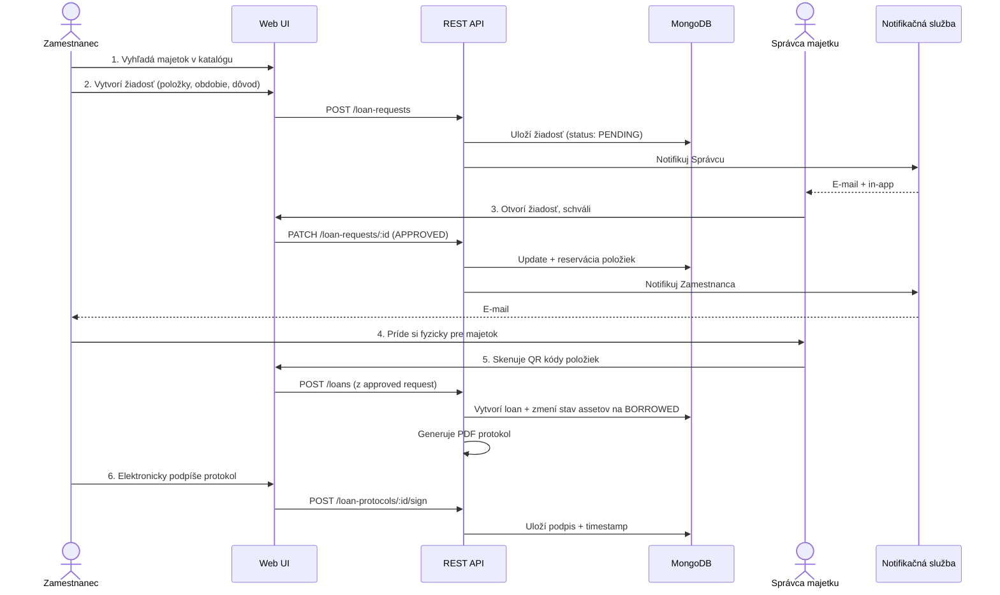
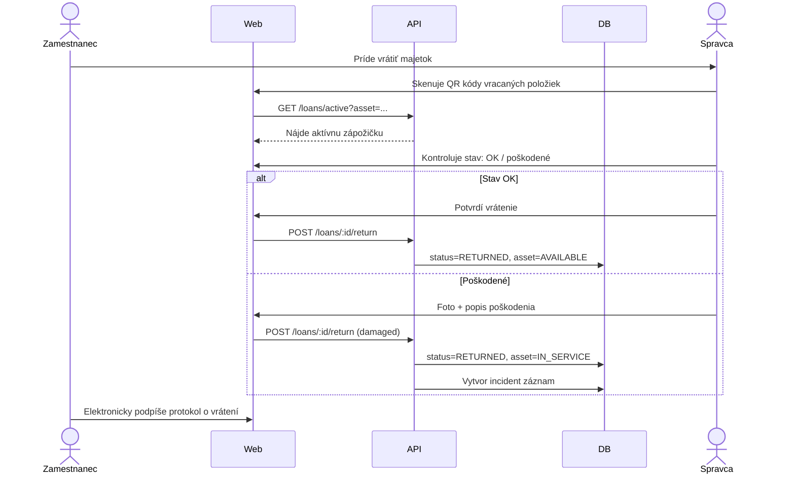
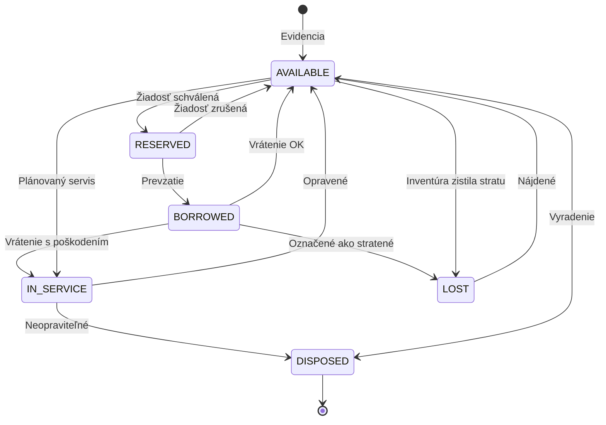
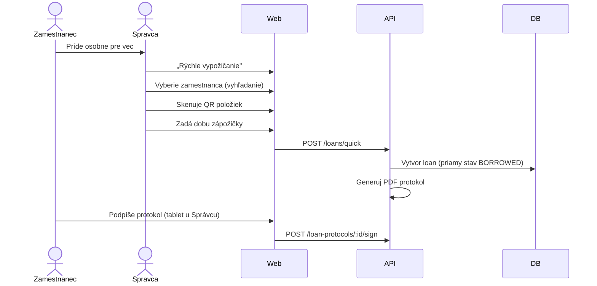

# Funkčná špecifikácia – Systém na správu a vypožičiavanie majetku SFZ

| | |
|---|---|
| **Verzia** | 0.1 (draft) |
| **Status** | Na pripomienkovanie |
| **Posledná aktualizácia** | máj 2026 |
| **Vlastník** | SFZ – _doplniť_ |
| **Typ systému** | Interný evidenčný systém (NIE účtovný) |

---

## Obsah

1. [Manažérske zhrnutie](#1-manažérske-zhrnutie)
2. [Vymedzenie rozsahu](#2-vymedzenie-rozsahu)
3. [Používateľské roly](#3-používateľské-roly)
4. [Funkčné moduly](#4-funkčné-moduly)
5. [Dátový model (high-level)](#5-dátový-model-high-level)
6. [User stories](#6-user-stories)
7. [Workflow diagramy](#7-workflow-diagramy)
8. [Nefunkčné požiadavky](#8-nefunkčné-požiadavky)
9. [Integrácie](#9-integrácie)
10. [Bezpečnosť a súlad s legislatívou](#10-bezpečnosť-a-súlad-s-legislatívou)
11. [Reporty a exporty](#11-reporty-a-exporty)
12. [Notifikácie](#12-notifikácie)
13. [Fázy implementácie](#13-fázy-implementácie)
14. [Otvorené otázky](#14-otvorené-otázky)
15. [Glossary](#15-glossary)

---

## 1. Manažérske zhrnutie

Slovenský futbalový zväz (ďalej len „SFZ") spravuje rozsiahly zmiešaný majetok – informačné technológie (notebooky, mobilné telefóny, monitory, sieťové prvky), športové vybavenie (dresy, lopty, tréningové pomôcky, výstroj reprezentácií a mládežníckych výberov) a kancelárske vybavenie. Tento majetok sa pohybuje medzi centrálou SFZ, regionálnymi a oblastnými zväzmi, reprezentačnými výjazdmi a externými používateľmi (tréneri, kluby).

Cieľom projektu je nahradiť súčasnú decentralizovanú evidenciu jednotným evidenčným a vypožičiavacím systémom. Systém pokryje životný cyklus majetku od evidencie cez vypožičanie a vrátenie až po vyradenie, s plnou auditovateľnosťou pohybov a podporou QR kódov pre rýchlu fyzickú identifikáciu.

Riešenie bude postavené ako webová aplikácia s mobilne optimalizovaným rozhraním a otvoreným REST API, čo umožní budúce rozšírenie o natívnu mobilnú aplikáciu (Flutter). Súčasťou riešenia bude aj MCP server (Model Context Protocol), ktorý umožní napojenie AI asistentov pre prácu s dátami systému.

### 1.1 Ciele projektu

| Cieľ | Merateľnosť |
|------|-------------|
| Centralizovať evidenciu majetku | 100 % majetku v jednom systéme do 6 mesiacov od nasadenia |
| Skrátiť čas vypožičania | Z priemerných ~15 min (papier) na <2 min cez QR sken |
| Zabezpečiť auditovateľnosť | 100 % pohybov má digitálny záznam s časovou pečiatkou a autorom |
| Znížiť stratovosť majetku | Cieľ: zníženie nevyhľadateľného majetku o 50 % v prvom roku |
| Integrácia s existujúcou IT infraštruktúrou SFZ | SSO cez Entra ID, jednotné prihlasovanie |

### 1.2 Kľúčové parametre

| Parameter | Hodnota |
|-----------|---------|
| Cieľový počet používateľov | 100 – 500 aktívnych |
| Predpokladaný počet evidovaných položiek | 5 000 – 20 000 |
| Predpokladaný počet pohybov ročne | 10 000 – 30 000 výpožičiek / vrátení |
| Typ majetku | Zmiešaný (IT, šport, kancelária) |
| Architektúra | Webová aplikácia + REST API + MongoDB Atlas |
| Hosting | Cloud (preferovane Azure) – TBD |
| Autentifikácia | Microsoft Entra ID (SSO) |
| Účtovné funkcie | NIE – výhradne evidenčný systém |

---

## 2. Vymedzenie rozsahu

### 2.1 V rozsahu projektu (In scope)

- Evidencia majetku s flexibilným dátovým modelom pre rôzne kategórie
- Generovanie a tlač QR kódov / čiarových kódov
- Workflow vypožičania, predĺženia a vrátenia majetku
- Hromadné operácie (preberanie sady položiek na jeden protokol)
- Elektronický podpis protokolov (kliknutie + audit záznam, prípadne nakreslený podpis)
- História pohybov a kompletný audit log
- Notifikácie (e-mail, in-app)
- Reporty a exporty (CSV, PDF protokoly)
- Správa používateľov a rolí, integrácia s Microsoft Entra ID
- REST API s OpenAPI 3.1 špecifikáciou
- MCP server pre AI integrácie
- Webové rozhranie optimalizované aj pre mobilné prehliadače (sken QR cez kameru)

### 2.2 Mimo rozsahu (Out of scope)

- **Účtovné funkcie** – odpisy, fakturácia, účtovné súvzťažnosti. Systém je čisto evidenčný.
- **Skladové hospodárstvo** – príjem na sklad od dodávateľov, dodávateľské procesy.
- **Natívna mobilná aplikácia** – v prvej fáze pripravujeme len API; Flutter app je samostatná fáza.
- **Servisné workflow** – evidenciu opráv a servisných zásahov rozšírime v druhej fáze ako jednoduchý stav „v servise" + poznámku, plnohodnotný servisný modul nie je súčasťou.
- **Integrácia s ekonomickým systémom SFZ** – ako budúca fáza, v prvej fáze len export CSV.
- **Rezervácia majetku do budúcnosti** – posúdiť vo fáze 2 podľa reálnej potreby.

### 2.3 Predpoklady

- SFZ má funkčný Microsoft 365 / Entra ID tenant.
- SFZ poskytne zoznam kategórií majetku, lokalít a organizačnú štruktúru pre import.
- SFZ poskytne grafický manuál (logo, farby) pre branding.
- Tlač QR kódov bude prebiehať na štandardných tlačiarňach štítkov (napr. Brother QL-820NWB) – konkrétny model treba potvrdiť.

---

## 3. Používateľské roly

Systém definuje päť používateľských rolí. Rola sa priraďuje cez členstvo v Entra ID skupinách, prípadne manuálne pre externých používateľov.

### 3.1 Administrátor

**Kto:** IT administrátor SFZ, system owner.

**Oprávnenia:**
- Plný prístup ku všetkým dátam a nastaveniam
- Správa číselníkov (kategórie, lokality, stavy)
- Správa používateľov a rolí
- Konfigurácia systému (SMTP, integrácie, Entra ID mapping)
- Prístup k audit logu a systémovým metrikám
- Reset zápožičiek v prípade chyby (s audit záznamom)

### 3.2 Správca majetku

**Kto:** Osoba zodpovedná za konkrétnu kategóriu majetku alebo lokalitu (napr. IT správca, sklad športového vybavenia, správca kancelárie).

**Oprávnenia:**
- Evidencia nových položiek vo svojej oblasti
- Úprava údajov o majetku
- Schvaľovanie žiadostí o vypožičanie
- Príjem vrátenia, kontrola stavu, evidencia poškodenia
- Vyradenie majetku (s odôvodnením)
- Tlač QR kódov
- Reporty pre svoju oblasť

> Systém podporuje viacero správcov pre rôzne oblasti (napr. „IT" vs „športové vybavenie reprezentácie A").

### 3.3 Manažér tímu / Vedúci úseku

**Kto:** Vedúci organizačnej jednotky, tréner reprezentácie, manažér mládežníckeho výberu.

**Oprávnenia:**
- Prehľad majetku priradeného svojej jednotke/tímu
- Žiadosť o vypožičanie pre seba aj pre podriadených (hromadne)
- Schválenie žiadostí podriadených (delegovaná zodpovednosť, podľa konfigurácie)
- Reporty pre svoj tím

### 3.4 Zamestnanec / Bežný používateľ

**Kto:** Bežný zamestnanec SFZ.

**Oprávnenia:**
- Prehľad katalógu dostupného majetku
- Podanie žiadosti o vypožičanie
- Prehľad vlastných aktívnych zápožičiek a histórie
- Potvrdenie prevzatia / vrátenia (elektronický podpis)
- Hlásenie problému / poškodenia majetku

### 3.5 Externý vypožičiavateľ

**Kto:** Tréner mimo SFZ, klub, externý partner.

**Oprávnenia:**
- Obmedzený prístup (cez magic link alebo limitovaný účet)
- Potvrdenie prevzatia / vrátenia
- Prehľad len vlastných aktívnych zápožičiek
- Bez prístupu ku katalógu, žiadostiam, reportom

> Externé účty vytvára Správca majetku alebo Administrátor; účet má povinne nastavený dátum platnosti a/alebo automaticky exspiruje po vrátení posledného majetku.

### 3.6 Matica oprávnení (skrátená)

| Akcia | Admin | Správca | Manažér | Zamestnanec | Externý |
|-------|:-----:|:-------:|:-------:|:-----------:|:-------:|
| Vidieť katalóg majetku | ✅ | ✅ | ✅ | ✅ | ❌ |
| Evidovať nový majetok | ✅ | ✅ (vo svojej oblasti) | ❌ | ❌ | ❌ |
| Upraviť údaje o majetku | ✅ | ✅ (vo svojej oblasti) | ❌ | ❌ | ❌ |
| Vyradiť majetok | ✅ | ✅ (vo svojej oblasti) | ❌ | ❌ | ❌ |
| Podať žiadosť o zápožičku | ✅ | ✅ | ✅ | ✅ | ❌ |
| Schváliť žiadosť | ✅ | ✅ | ✅ (podriadený) | ❌ | ❌ |
| Vidieť vlastné zápožičky | ✅ | ✅ | ✅ | ✅ | ✅ |
| Vidieť všetky zápožičky | ✅ | ✅ (vo svojej oblasti) | ✅ (svoj tím) | ❌ | ❌ |
| Vytvoriť používateľa | ✅ | ❌ | ❌ | ❌ | ❌ |
| Vytvoriť externý účet | ✅ | ✅ | ❌ | ❌ | ❌ |
| Spravovať číselníky | ✅ | ❌ | ❌ | ❌ | ❌ |
| Prístup k audit logu | ✅ | čiastočne | ❌ | ❌ | ❌ |

---

## 4. Funkčné moduly

### 4.1 Modul evidencie majetku

Hlavná entita systému je **karta majetku**. Každá položka má unikátne inventárne číslo a sadu spoločných atribútov, plus kategóriovo špecifické atribúty.

**Spoločné atribúty (všetky kategórie):**

- Inventárne číslo (systémovo generované, formát napr. `SFZ-2026-00001`)
- Externé inventárne číslo (voliteľné, pre majetok prevzatý z existujúcej evidencie)
- Názov položky
- Kategória (číselník)
- Podkategória (číselník)
- Popis
- Sériové číslo (ak relevantné)
- Výrobca / model
- Aktuálny stav (k dispozícii, vypožičané, v servise, vyradené, stratené)
- Aktuálna lokalita (číselník)
- Aktuálne priradená osoba (FK na používateľa, môže byť NULL)
- Dátum nadobudnutia
- Obstarávacia cena (informatívne, NIE účtovne)
- Záruka do (dátum)
- Fotografie (viacero, jedna primárna)
- Poznámky
- Tagy (voľný štítkovací systém)
- QR kód / čiarový kód (generovaný systémom)

**Kategóriovo špecifické atribúty (custom fields per category):**

| Kategória | Príklady špecifických atribútov |
|-----------|--------------------------------|
| Notebook | OS, RAM, disk, MAC adresa, šifrovanie disku (áno/nie) |
| Mobilný telefón | IMEI, SIM karta, OS verzia, telefónne číslo |
| Monitor | Uhlopriečka, rozlíšenie |
| Sieťový prvok | IP adresa, MAC adresa, lokalita v racku |
| Dres | Veľkosť, číslo, meno hráča, sezóna, typ (hostia/domáci) |
| Lopta | Veľkosť, typ (zápasová/tréningová), výrobca |
| Tréningová pomôcka | Typ, počet kusov v sade |
| Výstroj reprezentácie | Kategória reprezentácie, sezóna |

> Custom fields sú definované v číselníku kategórií. Administrátor môže pridávať nové polia bez zásahu do kódu (NoSQL/JSON schema).

**Stavy majetku (state machine):**

```
   ┌─────────────────┐
   │  K DISPOZÍCII   │◄────────────────┐
   └────────┬────────┘                 │
            │ žiadosť schválená        │
            ▼                          │
   ┌─────────────────┐                 │
   │  REZERVOVANÉ    │                 │
   └────────┬────────┘                 │
            │ prevzatie                │
            ▼                          │ vrátenie
   ┌─────────────────┐                 │
   │   VYPOŽIČANÉ    │─────────────────┤
   └────────┬────────┘                 │
            │ poškodenie               │
            ▼                          │
   ┌─────────────────┐    oprava       │
   │    V SERVISE    │─────────────────┘
   └────────┬────────┘
            │ neopraviteľné
            ▼
   ┌─────────────────┐
   │    VYRADENÉ     │ (terminal)
   └─────────────────┘

   STRATENÉ je samostatný stav – nastaviteľný z VYPOŽIČANÉ alebo K DISPOZÍCII.
```

**Hromadné operácie:**

- Hromadný import majetku z CSV (pre prvotnú migráciu)
- Hromadná zmena lokality (presun majetku medzi pobočkami)
- Hromadná tlač QR kódov
- Hromadné vyradenie

### 4.2 Modul vypožičiavania

**Životný cyklus zápožičky:**

1. **Žiadosť** – používateľ vytvorí žiadosť o vypožičanie jednej alebo viacerých položiek na konkrétne obdobie (od–do) s odôvodnením.
2. **Schválenie** – Správca majetku alebo Manažér tímu žiadosť schváli alebo zamietne (s komentárom).
3. **Prevzatie** – pri fyzickom prevzatí Správca naskenuje QR kódy položiek, používateľ elektronicky podpíše protokol o prevzatí. Generuje sa PDF protokol.
4. **Aktívna zápožička** – položka je v stave VYPOŽIČANÉ, priradená používateľovi. Systém posiela notifikácie pred koncom doby zápožičky.
5. **Predĺženie (voliteľné)** – používateľ môže požiadať o predĺženie, schvaľuje Správca.
6. **Vrátenie** – Správca skenuje QR kódy vracaných položiek, kontroluje stav, prípadne eviduje poškodenie. Používateľ aj Správca podpisujú protokol o vrátení.
7. **Po vrátení** – položka sa vráti do stavu K DISPOZÍCII (alebo V SERVISE, ak je poškodená).

**Hromadné vypožičanie (kľúčová funkcia pre SFZ):**

Tréner reprezentácie môže na jeden protokol prevziať celú sadu (napr. 25 dresov, 10 lôpt, 3 sady kužeľov, 1 lekárničku). Systém:
- Umožní pridať do žiadosti viacero položiek naraz (vyhľadanie + sken + manuálne zadanie inventárneho čísla)
- Vygeneruje jeden konsolidovaný PDF protokol so zoznamom všetkých položiek
- Pri vrátení môže používateľ vrátiť celú sadu naraz alebo postupne po častiach (čiastočné vrátenie)

**Žiadosti bez katalógu (rýchle vypožičanie):**

Pre prípady, keď Správca sedí pri sklade a zamestnanec si príde fyzicky pre vec: Správca skenuje QR, vyberie zamestnanca, dobu, hotovo. Systém vytvorí zápožičku okamžite (bez kroku „žiadosť"), s audit záznamom.

### 4.3 Modul katalógu

- Vyhľadávanie a filtrovanie majetku (full-text, podľa kategórie, lokality, stavu, dostupnosti)
- Pohľad katalógu pre zamestnancov (čo je momentálne k dispozícii na vypožičanie)
- Detailný pohľad na kartu majetku s históriou pohybov
- Fotky, popis, špecifikácie
- Indikátor dostupnosti (kedy je voľné)

### 4.4 Modul histórie a auditu

- **História pohybov položky** – chronologický záznam všetkých zápožičiek, presunov, servisných zásahov.
- **Audit log** – systémový log všetkých zmien dát (CRUD operácie) s časovou pečiatkou, autorom, IP adresou a diff-om hodnôt (kto čo zmenil).
- **Retencia audit logu** – minimálne 5 rokov (konfigurovateľné).
- **Nezmazateľnosť** – audit záznamy sú append-only, nemožno ich upravovať ani mazať (na úrovni databázy).

### 4.5 Modul správy používateľov

- Synchronizácia s Entra ID (sync používateľov a skupín)
- Mapovanie Entra ID skupín na systémové roly
- Manuálne pridávanie externých používateľov (mimo Entra ID)
- Deaktivácia účtu (s ošetrením otvorených zápožičiek – prevod zodpovednosti, alebo blokácia deaktivácie)

### 4.6 Modul reportov a exportov

(Viď sekciu [11. Reporty a exporty](#11-reporty-a-exporty).)

### 4.7 Modul notifikácií

(Viď sekciu [12. Notifikácie](#12-notifikácie).)

### 4.8 Modul MCP servera

Samostatná aplikácia, ktorá vystaví funkcie systému ako MCP tools. Detailná špecifikácia: [docs/architecture/mcp-server.md](architecture/mcp-server.md).

**Príklady vystavených tools:**
- `search_assets(query, category, status, location)` – vyhľadanie majetku
- `get_my_loans()` – moje aktívne zápožičky
- `get_asset_history(inventory_number)` – história položky
- `get_user_assets(user_email)` – majetok priradený osobe (admin/správca)
- `get_overdue_loans()` – zápožičky po splatnosti
- `get_assets_by_age(years)` – majetok starší ako N rokov

**Autentifikácia MCP:** OAuth 2.1 (per MCP spec) alebo personal access token, s rovnakými oprávneniami ako webové rozhranie.

---

## 5. Dátový model (high-level)

> Detailný dátový model je v [docs/architecture/data-model.md](architecture/data-model.md). Tu uvádzame len kľúčové kolekcie.

### 5.1 MongoDB kolekcie

| Kolekcia | Účel |
|----------|------|
| `users` | Používatelia (interní + externí), prepojené na Entra ID |
| `roles` | Definícia rolí a oprávnení |
| `assets` | Karty majetku |
| `categories` | Číselník kategórií + definícia custom fields |
| `locations` | Číselník lokalít (centrála, regiónal. zväzy, sklady) |
| `loan_requests` | Žiadosti o vypožičanie |
| `loans` | Aktívne a historické zápožičky |
| `loan_protocols` | PDF protokoly (prevzatie/vrátenie) + metadata |
| `asset_history` | Chronológia pohybov pre každú položku |
| `audit_log` | Systémový audit log (append-only) |
| `notifications` | Fronta notifikácií + história odoslaní |
| `attachments` | Metadata pre fotky, prílohy (binárne dáta v object storage) |

### 5.2 Kľúčové vzťahy

```
User ──< LoanRequest ──> Asset (M:N cez položky žiadosti)
User ──< Loan ──> Asset (M:N cez položky zápožičky)
Asset ──> Category ──> CustomFieldsDefinition
Asset ──> Location
Asset ──< AssetHistory
Loan ──> LoanProtocol (1:N – prevzatie + vrátenie + prípadné poškodenia)
```

### 5.3 Indexy (predbežne)

- `assets.inventoryNumber` (unique)
- `assets.qrCode` (unique)
- `assets.status + assets.location` (compound, pre filtrovanie katalógu)
- `assets.assignedTo` (pre pohľad „môj majetok")
- `loans.status + loans.dueDate` (pre overdue notifikácie)
- `loans.borrowerId + loans.status` (pre moje zápožičky)
- `audit_log.timestamp + audit_log.entityType` (pre dotazy do logu)
- Full-text index na `assets` (názov, popis, sériové číslo, tagy)

---

## 6. User stories

User stories sú zoskupené do epikov. Každá user story má identifikátor (`US-XXX`), priority (P1 = MVP, P2 = fáza 2, P3 = nice-to-have) a kritériá akceptácie.

### Epic 1: Správa majetku

**US-001 (P1)** – Ako *Správca majetku* chcem **zaevidovať novú položku majetku** vyplnením formulára, aby som ju mohol sledovať v systéme.
- AC: Formulár obsahuje povinné polia + dynamicky zobrazené custom fields podľa kategórie.
- AC: Po uložení sa vygeneruje inventárne číslo a QR kód.
- AC: Možnosť pridať fotografie (drag & drop, max 10 ks, max 5 MB/súbor).

**US-002 (P1)** – Ako *Správca majetku* chcem **vytlačiť QR štítok**, aby som ho mohol nalepiť na fyzický majetok.
- AC: Tlač cez prehliadač s preddefinovanou veľkosťou štítku.
- AC: Možnosť hromadnej tlače pre viacero položiek.
- AC: Štítok obsahuje QR + inventárne číslo + krátky názov.

**US-003 (P1)** – Ako *Správca majetku* chcem **upraviť údaje o majetku**, aby som mohol opraviť chyby alebo doplniť informácie.
- AC: Všetky zmeny sa logujú do audit logu.
- AC: Inventárne číslo nemožno meniť (len v špeciálnom režime adminom).

**US-004 (P1)** – Ako *Správca majetku* chcem **vyradiť majetok** s povinným odôvodnením, aby história zostala zachovaná.
- AC: Vyradenú položku nemožno vypožičiavať, ale je viditeľná v histórii.
- AC: Odôvodnenie je povinné textové pole.

**US-005 (P1)** – Ako *Administrátor* chcem **importovať existujúci majetok z CSV**, aby som nemusel ručne zadávať tisíce položiek.
- AC: Šablóna CSV na stiahnutie.
- AC: Náhľad pred importom + validácia.
- AC: Report o úspešnosti (počet úspešných / chybných riadkov + dôvody).

**US-006 (P2)** – Ako *Správca majetku* chcem **definovať vlastné polia pre kategóriu**, aby som vedel evidovať atribúty špecifické pre daný typ majetku.
- AC: Typy polí: text, číslo, dátum, výber zo zoznamu, áno/nie.
- AC: Pole môže byť povinné alebo voliteľné.

### Epic 2: Vypožičiavanie

**US-010 (P1)** – Ako *Zamestnanec* chcem **podať žiadosť o vypožičanie**, aby som získal majetok na prácu.
- AC: Výber jednej alebo viacerých položiek z katalógu.
- AC: Zadanie obdobia (od–do) a odôvodnenia.
- AC: Notifikácia Správcovi o novej žiadosti.

**US-011 (P1)** – Ako *Správca majetku* chcem **schváliť alebo zamietnuť žiadosť**, aby som riadil dostupnosť majetku.
- AC: Pri zamietnutí povinný komentár.
- AC: Notifikácia žiadateľovi o výsledku.

**US-012 (P1)** – Ako *Správca majetku* chcem **vydať majetok skenovaním QR kódov**, aby som proces zrýchlil.
- AC: Sken cez kameru telefónu / webkameru.
- AC: Manuálne zadanie inventárneho čísla ako alternatíva.
- AC: Po naskenovaní všetkých položiek generovanie PDF protokolu.

**US-013 (P1)** – Ako *Zamestnanec* chcem **elektronicky podpísať protokol o prevzatí**, aby bol akt formalizovaný.
- AC: Klik na tlačidlo „Potvrdzujem prevzatie" + voliteľne nakreslený podpis prstom/myšou.
- AC: Záznam IP, časovej pečiatky a user agentu.

**US-014 (P1)** – Ako *Tréner reprezentácie* chcem **hromadne vypožičať sadu vybavenia** (dresy, lopty, výstroj) na jeden protokol.
- AC: Pridanie viacerých položiek (sken + vyhľadávanie + manuálne).
- AC: Konsolidovaný protokol s presným zoznamom.
- AC: Možnosť čiastočného vrátenia (po častiach).

**US-015 (P1)** – Ako *Správca majetku* chcem **prijať vrátenie majetku** so záznamom stavu, aby bola dokumentovaná zodpovednosť.
- AC: Sken QR + výber stavu (OK / poškodené / chýba príslušenstvo).
- AC: Pri poškodení možnosť pridať fotografie a popis.
- AC: Pri poškodení sa položka prepne do stavu V SERVISE.

**US-016 (P2)** – Ako *Zamestnanec* chcem **požiadať o predĺženie zápožičky**, aby som nemusel vrátiť a znovu žiadať.
- AC: Tlačidlo „Predĺžiť" pri vlastnej zápožičke.
- AC: Schválenie Správcom.

**US-017 (P1)** – Ako *Správca majetku* chcem **vykonať rýchle vypožičanie bez predošlej žiadosti**, keď za mnou príde zamestnanec osobne.
- AC: Vyber používateľa → sken QR → zadaj dobu → hotovo.
- AC: Audit záznam o spôsobe vypožičania.

### Epic 3: Vyhľadávanie a katalóg

**US-020 (P1)** – Ako *Používateľ* chcem **vyhľadať majetok** podľa názvu, inventárneho čísla alebo sériového čísla.
- AC: Full-text vyhľadávanie s instant výsledkami.
- AC: Filtre: kategória, stav, lokalita.

**US-021 (P1)** – Ako *Používateľ* chcem **naskenovať QR kód** a okamžite vidieť kartu majetku.
- AC: Sken cez kameru otvorí kartu majetku.
- AC: Funguje aj cez mobilný prehliadač.

**US-022 (P2)** – Ako *Zamestnanec* chcem **vidieť kalendár dostupnosti** položky, aby som vedel, kedy si ju môžem požičať.
- AC: Zobrazenie obsadenosti v čase.

### Epic 4: Reporty a história

**US-030 (P1)** – Ako *Správca majetku* chcem **vidieť históriu pohybov položky**, aby som mal prehľad o jej životnom cykle.
- AC: Chronologický zoznam zápožičiek, presunov, servisných zásahov.

**US-031 (P1)** – Ako *Administrátor* chcem **exportovať zoznam majetku do CSV** pre potreby inventarizácie.
- AC: Exportovať všetky alebo filtrovanú množinu.

**US-032 (P1)** – Ako *Správca majetku* chcem **vidieť zápožičky po splatnosti**, aby som vedel zasiahnuť.
- AC: Dashboard widget + samostatný report.

**US-033 (P2)** – Ako *Administrátor* chcem **vidieť štatistiky využitia majetku** (najčastejšie vypožičiavané, nevyužívané), aby som vedel optimalizovať nákupy.

### Epic 5: Notifikácie

**US-040 (P1)** – Ako *Zamestnanec* chcem **dostať notifikáciu pred koncom doby zápožičky**, aby som stihol vrátiť alebo predĺžiť.
- AC: E-mail 3 dni a 1 deň pred koncom.
- AC: In-app notifikácia.

**US-041 (P1)** – Ako *Správca majetku* chcem **dostať notifikáciu o novej žiadosti**, aby som mohol rýchlo reagovať.

**US-042 (P1)** – Ako *Zamestnanec* chcem **dostať notifikáciu o schválení/zamietnutí žiadosti**.

### Epic 6: Správa používateľov a SSO

**US-050 (P1)** – Ako *Zamestnanec SFZ* chcem **prihlásiť sa cez firemný účet** (Entra ID SSO), aby som nemusel mať ďalšie heslo.
- AC: Tlačidlo „Prihlásiť cez Microsoft" na úvodnej stránke.
- AC: Po prvom prihlásení sa automaticky vytvorí účet so štandardnou rolou.

**US-051 (P1)** – Ako *Administrátor* chcem **namapovať Entra ID skupiny na systémové roly**, aby som automatizoval prideľovanie oprávnení.

**US-052 (P1)** – Ako *Správca majetku* chcem **vytvoriť externý účet** pre osobu mimo SFZ (tréner, klub) s obmedzeným prístupom.
- AC: Účet má dátum exspirácie.
- AC: Prístup len cez magic link alebo limitované prihlásenie (NIE Entra ID).

### Epic 7: MCP server a AI integrácie

**US-060 (P2)** – Ako *Zamestnanec* chcem **cez AI asistenta (Claude) zistiť, čo mám aktuálne vypožičané**, aby som ušetril čas.
- AC: MCP server vystavuje tool `get_my_loans`.

**US-061 (P2)** – Ako *Administrátor* chcem **cez AI asistenta nájsť všetky notebooky staršie ako 4 roky**, aby som plánoval obmenu.
- AC: MCP tool `get_assets_by_age(years, category)`.

---

## 7. Workflow diagramy

> Diagramy sú v Mermaid syntaxe – GitHub a väčšina Markdown renderov ich zobrazí natívne.

### 7.1 Workflow vypožičania (štandardné)



### 7.2 Workflow vrátenia s kontrolou stavu



### 7.3 Stavový diagram majetku



### 7.4 Workflow rýchleho vypožičania (bez žiadosti)



---

## 8. Nefunkčné požiadavky

### 8.1 Výkon

| Požiadavka | Hodnota |
|------------|---------|
| Doba odozvy API (P95) | < 300 ms pre čítacie operácie |
| Doba odozvy API (P95) | < 800 ms pre zápisové operácie |
| Doba načítania webovej stránky (P95) | < 2 s na 4G mobile |
| Kapacita súbežných používateľov | minimálne 100 simultánnych používateľov bez degradácie |
| Sken QR + zobrazenie karty | < 1 s od potvrdenia skenu |

### 8.2 Dostupnosť

| Požiadavka | Hodnota |
|------------|---------|
| Cieľová dostupnosť | 99,5 % mesačne (cca 3,6 h výpadku/mes) |
| Plánované odstávky | Mimo pracovnej doby, oznámené min. 48 h vopred |
| RTO (Recovery Time Objective) | < 4 hodiny |
| RPO (Recovery Point Objective) | < 1 hodina (zálohy DB) |

### 8.3 Bezpečnosť

- Všetka komunikácia cez HTTPS (TLS 1.2+).
- Heslá pre externé účty hashované cez bcrypt/argon2.
- JWT tokeny s krátkou platnosťou (15 min) + refresh tokeny (7 dní).
- Rate limiting na API (default 100 req/min per user, konfigurovateľné).
- CSRF ochrana, CORS striktne konfigurovaný.
- Detaily: [10. Bezpečnosť a súlad s legislatívou](#10-bezpečnosť-a-súlad-s-legislatívou)

### 8.4 Škálovateľnosť

- Stateless API (možnosť horizontálneho škálovania).
- MongoDB Atlas auto-scaling.
- Object storage pre prílohy (S3-kompatibilné), nie lokálny disk.

### 8.5 Použiteľnosť

- Plne lokalizované do **slovenčiny** (primárny jazyk).
- Pripravené na ďalšie lokalizácie (i18n knižnica – `next-intl`).
- Responzívny dizajn: desktop, tablet, mobil.
- WCAG 2.1 úroveň AA (kontrast, klávesnicová navigácia, ARIA).

### 8.6 Prehliadače

- Chrome / Edge (posledné 2 verzie)
- Firefox (posledné 2 verzie)
- Safari (posledné 2 verzie, vrátane mobilného)

### 8.7 Údržba a monitoring

- Štruktúrované logy (JSON) odosielané do centrálneho logovania (napr. Grafana Loki, Datadog).
- Metriky (Prometheus / Application Insights): RPS, error rate, latency, DB connection pool.
- Alerty na chybovosť > 1 %, latenciu > definovaného prahu, vyčerpanie zdrojov.
- Health check endpoint `/health` + `/ready`.

---

## 9. Integrácie

### 9.1 Microsoft Entra ID (povinné, fáza 1)

- **Protokol:** OpenID Connect (OIDC)
- **Účel:** SSO pre zamestnancov SFZ
- **Sync skupín:** automatický mapping Entra ID skupín → systémové roly
- **Microsoft Graph API:** sync používateľov (meno, e-mail, oddelenie, manažér)

### 9.2 E-mail (povinné, fáza 1)

- **Protokol:** SMTP alebo Microsoft Graph (poslať ako SFZ účet)
- **Účel:** notifikácie
- **Predpoklad:** SFZ poskytne SMTP účet alebo Graph aplikačné oprávnenie

### 9.3 Object storage (povinné, fáza 1)

- **Typ:** S3-kompatibilné (Azure Blob, AWS S3, MinIO pre on-prem)
- **Účel:** fotografie majetku, PDF protokoly

### 9.4 MCP server (povinné, fáza 1)

- **Protokol:** Model Context Protocol (JSON-RPC nad SSE/stdio)
- **Účel:** integrácia s AI asistentmi
- **Detaily:** [docs/architecture/mcp-server.md](architecture/mcp-server.md)

### 9.5 Ekonomický systém SFZ (voliteľné, fáza 2)

- **Účel:** synchronizácia číselníka majetku s účtovníctvom
- **Mechanizmus:** export CSV / API integrácia – v závislosti od typu ekonomického systému
- **Stav:** mimo prvej fázy, len export CSV

### 9.6 Microsoft Teams (voliteľné, fáza 2)

- **Účel:** notifikácie a chatbot pre interakciu so systémom
- **Mechanizmus:** Teams webhook + adaptive cards

---

## 10. Bezpečnosť a súlad s legislatívou

### 10.1 GDPR

- Systém spracúva osobné údaje zamestnancov a externých používateľov.
- **Účel spracovania:** evidencia majetku priradeného osobe, evidencia výpožičiek.
- **Právny základ:** oprávnený záujem zamestnávateľa + plnenie zmluvy.
- **Retencia:**
  - Aktívne účty: po dobu trvania pracovného vzťahu
  - Historické záznamy zápožičiek: 5 rokov po vrátení (audit, riešenie sporov)
  - Audit log: 5 rokov
- **Práva dotknutej osoby:** prístup k údajom, oprava, výmaz (s výhradou audit logu kvôli oprávneným záujmom), export.
- **Anonymizácia:** po uplynutí retenčnej doby sa osobné údaje v historických zápožičkách nahradia ID-čkom (pseudonymizácia).

### 10.2 Bezpečnostné štandardy

- **Šifrovanie at-rest:** MongoDB Atlas encryption at rest (AES-256), object storage encryption.
- **Šifrovanie in-transit:** TLS 1.2+ všade.
- **Autentifikácia:** SSO Entra ID + MFA (vyžaduje SFZ na úrovni Entra ID).
- **Autorizácia:** RBAC s jemnozrnnými oprávneniami.
- **Hesielná politika** (pre externé účty): min. 12 znakov, kombinácia, nepoužité posledných 5.
- **Pravidelné penetračné testy** odporúčané ročne.

### 10.3 Audit a compliance

- Všetky CRUD operácie logované do nezmazateľného audit logu.
- Pravidelné review prístupových oprávnení (kvartálne).
- Možnosť exportu audit logu pre orgány alebo internú kontrolu.

---

## 11. Reporty a exporty

### 11.1 Štandardné reporty

| Report | Cieľová skupina | Filtre |
|--------|-----------------|--------|
| Zoznam majetku | Admin, Správca | Kategória, lokalita, stav, dátum nadobudnutia |
| Aktívne zápožičky | Admin, Správca, Manažér | Lokalita, osoba, kategória |
| Zápožičky po splatnosti | Admin, Správca | Lokalita, počet dní omeškania |
| História osoby | Admin, Správca, Manažér (svojich) | Časové obdobie |
| História položky | Admin, Správca | Časové obdobie |
| Vyradený majetok | Admin, Správca | Časové obdobie, dôvod |
| Štatistika využitia (P2) | Admin | Kategória, obdobie |
| Inventárny zoznam k dátumu | Admin, Správca | Dátum, lokalita |

### 11.2 Formáty exportov

- **CSV** – štruktúrované dáta (Excel kompatibilný, UTF-8 s BOM)
- **PDF** – protokoly, formálne výstupy
- **JSON** – cez API, pre integrácie

### 11.3 Plánované exporty (fáza 2)

- Pravidelný e-mail s reportom (denný/týždenný/mesačný) konfigurovateľný per používateľ.

---

## 12. Notifikácie

### 12.1 Kanály

- **E-mail** – primárny kanál
- **In-app** – zvonček v hlavičke webu, history list
- **Microsoft Teams** – fáza 2

### 12.2 Typy notifikácií

| Notifikácia | Trigger | Príjemca |
|-------------|---------|----------|
| Nová žiadosť o vypožičanie | Žiadosť vytvorená | Správca relevantnej kategórie |
| Žiadosť schválená | Schválenie | Žiadateľ |
| Žiadosť zamietnutá | Zamietnutie | Žiadateľ |
| Pripomienka pred koncom zápožičky | 3 dni / 1 deň pred | Vypožičiavateľ |
| Zápožička po splatnosti | Deň po splatnosti, potom týždenne | Vypožičiavateľ + Správca |
| Externý účet exspiruje | 7 dní pred exspiráciou | Externý + Správca, ktorý ho vytvoril |
| Majetok poškodený | Vrátenie s poškodením | Správca + Admin |
| Týždenný digest pre Správcu | Pondelok ráno | Správca |

### 12.3 Preferencie

Používateľ si môže v profile vypnúť konkrétne typy notifikácií (okrem kritických – schválenia, splatnosť).

---

## 13. Fázy implementácie

### Fáza 0: Príprava (2–3 týždne)

- Schválenie funkčnej špecifikácie (tento dokument)
- Príprava architektonického dokumentu, OpenAPI spec, dátového modelu
- Setup repa, CI/CD, dev prostredia
- Príprava MongoDB Atlas, Entra ID app registration

### Fáza 1: MVP (8–10 týždňov)

**Cieľ:** spustiteľný systém s kľúčovými funkciami pre pilot.

- Modul evidencie majetku (CRUD, QR generovanie, tlač štítkov)
- Modul vypožičiavania (žiadosť → schválenie → prevzatie → vrátenie)
- Hromadné vypožičanie + čiastočné vrátenie
- Rýchle vypožičanie (bez žiadosti)
- SSO cez Entra ID
- Základné notifikácie (e-mail + in-app)
- Audit log
- Základné reporty (zoznam, aktívne zápožičky, po splatnosti)
- Import z CSV
- Webové UI (responzívne)
- REST API + OpenAPI spec
- Pilotné nasadenie pre obmedzenú skupinu (IT oddelenie SFZ)

### Fáza 2: Rozšírenie (6–8 týždňov)

- MCP server pre AI integrácie
- Custom fields pre kategórie
- Pokročilé reporty + štatistiky
- Predĺženie zápožičky
- Kalendár dostupnosti
- Teams notifikácie
- Plný rollout na všetkých používateľov

### Fáza 3: Mobilná aplikácia (8–12 týždňov, paralelne s Fázou 2)

- Flutter aplikácia (iOS + Android) postavená nad existujúcim REST API
- Offline-first sken QR (cache + sync)
- Push notifikácie
- Distribúcia cez TestFlight / Google Play

### Fáza 4: Údržba a optimalizácia (priebežne)

- Integrácia s ekonomickým systémom
- Servisný modul (full lifecycle)
- Rezervácie do budúcnosti
- Štatistiky a ML predikcie (využitie, predikcia obnovy)

---

## 14. Otvorené otázky

Tieto otázky treba vyriešiť pred alebo počas Fázy 0.

| ID | Otázka | Vlastník | Termín |
|----|--------|----------|--------|
| Q-01 | Hosting: Azure cloud, on-premise alebo hybrid? | IT SFZ | pred Fázou 0 |
| Q-02 | Konkrétny model tlačiarne štítkov (rozmery, počet kópií)? | IT SFZ | Fáza 0 |
| Q-03 | Bude SFZ migrovať existujúce dáta? Z akého formátu (Excel, iný systém)? | SFZ | Fáza 0 |
| Q-04 | Aké organizačné jednotky a lokality treba do číselníka? | SFZ HR/IT | Fáza 0 |
| Q-05 | Kto preberá zodpovednosť za majetok zamestnanca, ktorý odíde zo SFZ? | SFZ HR | Fáza 0 |
| Q-06 | Bude potrebná integrácia s ekonomickým systémom v prvej fáze? Aký systém? | Ekonomické odd. | Fáza 1 |
| Q-07 | Súhlasí SFZ s otvorenou licenciou pre internú open-source distribúciu kódu (interná komunita)? | Vedenie SFZ | pred Fázou 0 |
| Q-08 | Aké sú očakávané SLA voči externým používateľom (klubom)? | SFZ | Fáza 1 |
| Q-09 | Bude potrebné integrovať s registrami SFZ (registračný systém klubov, hráčov)? | IT SFZ | Fáza 2 |
| Q-10 | Branding – grafický manuál, logo, farby. | Marketing SFZ | Fáza 0 |

---

## 15. Glossary

| Pojem | Vysvetlenie |
|-------|-------------|
| **Asset / Majetok** | Konkrétna fyzická položka evidovaná v systéme. |
| **Karta majetku** | Detailný záznam o jednej položke majetku. |
| **Inventárne číslo** | Unikátny identifikátor položky vo formáte `SFZ-RRRR-NNNNN`. |
| **Zápožička / Loan** | Aktívny záznam o vypožičanej položke (od – do). |
| **Žiadosť o zápožičku / Loan Request** | Predprípravná žiadosť pred fyzickým prevzatím. |
| **Protokol** | PDF dokument o prevzatí alebo vrátení (s podpismi). |
| **Hromadná zápožička** | Jeden protokol pre viacero položiek. |
| **Čiastočné vrátenie** | Vrátenie len časti hromadnej zápožičky. |
| **Custom fields** | Kategóriovo špecifické atribúty (napr. RAM pre notebook, veľkosť pre dres). |
| **Audit log** | Nezmazateľný záznam systémových udalostí. |
| **MCP** | Model Context Protocol – štandard pre integráciu AI asistentov s nástrojmi. |
| **Entra ID** | Microsoft Entra ID (predtým Azure AD) – identity provider SFZ. |
| **SSO** | Single Sign-On – jednotné prihlasovanie. |
| **OIDC** | OpenID Connect – autentifikačný protokol nad OAuth 2.0. |
| **RBAC** | Role-Based Access Control – riadenie prístupu cez roly. |
| **MVP** | Minimum Viable Product – minimálne nasaditeľný produkt. |
| **ADR** | Architecture Decision Record – záznam architektonického rozhodnutia. |
| **P1/P2/P3** | Priority: P1 = MVP, P2 = fáza 2, P3 = nice-to-have. |
| **RTO/RPO** | Recovery Time / Recovery Point Objective – ciele obnovy. |

---

## Schvaľovanie dokumentu

| Rola | Meno | Dátum | Podpis |
|------|------|-------|--------|
| Product owner | _______________ | _______________ | _______________ |
| IT manažér SFZ | _______________ | _______________ | _______________ |
| Vedenie SFZ | _______________ | _______________ | _______________ |
