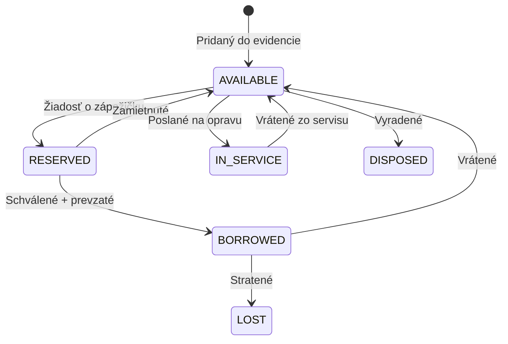

<!--
TEMPLATE: Reference
====================
Reference dokument je presná, štruktúrovaná informácia. Čitateľ ho
**vyhľadáva**, nie sekvenčne číta.

NIE JE: tutoriál, how-to, use case, prose.
JE: tabuľka, zoznam, presná definícia – ľahko vyhľadateľné.

Premenné na vyplnenie sú v {{ dvojitých zložených zátvorkách }}.
-->

# {{ Názov referencie – napr. "Stavy majetku a zápožičiek" }}

{{ Jedna-dve vety na úvod – čo je v tomto dokumente a kedy ho použiť.
Napríklad: „Tento dokument obsahuje úplný zoznam možných stavov majetku
a zápožičiek v systéme SFZ Asset Management. Použi ho ako rýchlu referenciu,
keď si nie si istý, čo daný stav znamená alebo aký prechod je možný." }}

## {{ Kategória 1 – napr. "Stavy majetku" }}

| Kód | Názov | Význam | Farba v UI |
|-----|-------|--------|------------|
| {{ `AVAILABLE` }} | {{ Dostupné }} | {{ Majetok je v sklade a pripravený na zápožičku. }} | {{ 🟢 Zelená }} |
| {{ `RESERVED` }} | {{ Rezervované }} | {{ Niekto požiadal o zápožičku, čaká sa na schválenie. }} | {{ 🟡 Žltá }} |
| {{ ... }} | {{ ... }} | {{ ... }} | {{ ... }} |

### Možné prechody stavov

## {{ Kategória 2 – napr. "Stavy zápožičiek" }}

| Kód | Názov | Význam |
|-----|-------|--------|
| {{ ... }} | {{ ... }} | {{ ... }} |

## Často zamieňané pojmy

### {{ Pojem 1 vs Pojem 2 – napr. "Rezervácia vs Zápožička" }}

{{ Vysvetlenie, čím sa líšia. Napr. "Rezervácia je len **požiadavka** o zápožičku, ktorá ešte nebola schválená. Zápožička je už **aktívna**, t. j. majetok je fyzicky u používateľa." }}

## Súvisiace

- {{ [Ako si požičať majetok](../how-to/poziciat-majetok.md) }}
- {{ [Slovník pojmov](./slovnik.md) }}

---

Posledná aktualizácia: {{ YYYY-MM-DD }}
