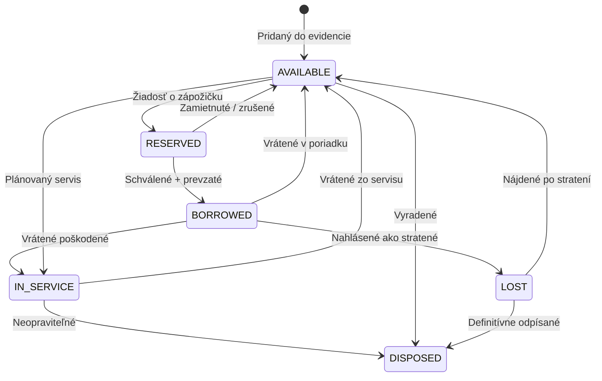
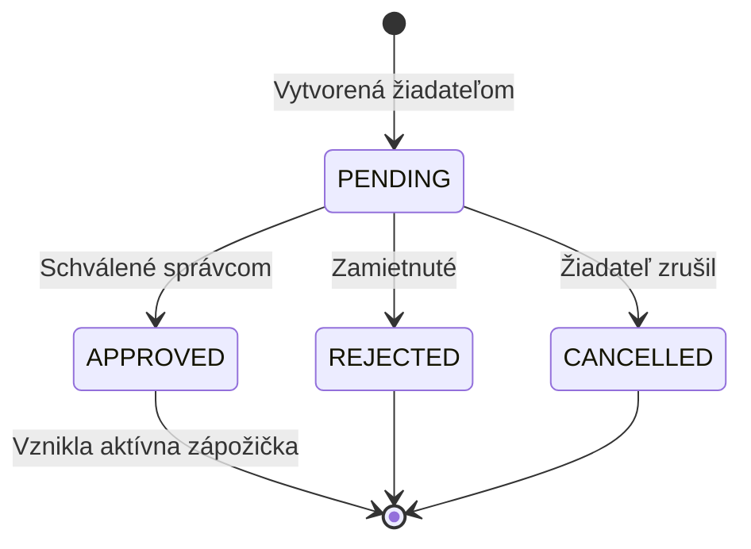
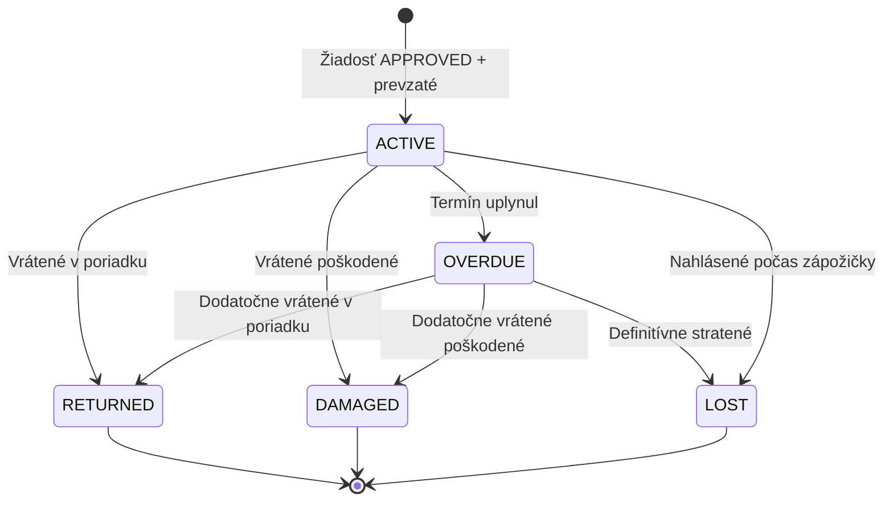

# Stavy majetku a zápožičiek

Tento dokument obsahuje **úplný zoznam stavov**, v ktorých sa môže majetok a zápožička nachádzať. Použi ho ako rýchlu referenciu, keď nevieš, čo daný stav znamená alebo aké prechody sú možné.

## Stavy majetku (Asset Status)

| Kód          | Názov       | Farba v UI  | Význam                                           |
| ------------ | ----------- | ----------- | ------------------------------------------------ |
| `AVAILABLE`  | Dostupné    | 🟢 Zelená   | V sklade, pripravené na zápožičku                |
| `RESERVED`   | Rezervované | 🟡 Žltá     | Niekto požiadal o zápožičku, čaká na schválenie  |
| `BORROWED`   | Zapožičané  | 🔵 Modrá    | Aktívne zapožičané používateľovi                 |
| `IN_SERVICE` | V servise   | 🟠 Oranžová | Na oprave alebo údržbe                           |
| `DISPOSED`   | Vyradené    | ⚪ Sivá     | Trvalo vyradené z evidencie (zastarané, predané) |
| `LOST`       | Stratené    | 🔴 Červená  | Nahlásené ako stratené počas zápožičky           |

> 💡 **Tip:** Farby zodpovedajú SFZ design tokens. Vidíš ich konzistentne v celom UI — v zozname majetku, v detaile, vo filteroch aj v reportoch.

### Životný cyklus majetku

### Pravidlá prechodov

- **Iba `AVAILABLE` → `RESERVED`** môže iniciovať bežný používateľ (cez žiadosť)
- **`BORROWED` → cokoľvek** rieši správca pri vrátení
- **Prechod na `DISPOSED` je nezvratný** — vyžaduje súhlas administrátora
- **Prechod na `LOST`** automaticky vytvorí incident v audit logu

---

## Stavy žiadosti o zápožičku (Loan Request Status)

| Kód         | Názov              | Farba v UI | Význam                                              |
| ----------- | ------------------ | ---------- | --------------------------------------------------- |
| `PENDING`   | Čaká na schválenie | 🟡 Žltá    | Žiadosť bola odoslaná, schvaľovateľ ešte nerozhodol |
| `APPROVED`  | Schválené          | 🟢 Zelená  | Schválené, môže byť prevzaté                        |
| `REJECTED`  | Zamietnuté         | 🔴 Červená | Schvaľovateľ zamietol                               |
| `CANCELLED` | Zrušené            | ⚪ Sivá    | Žiadateľ stiahol žiadosť pred schválením            |

### Životný cyklus žiadosti

### Špeciálne prípady

#### Čiastočné schválenie (Partial approval)

Pri hromadných žiadostiach môže schvaľovateľ schváliť **len niektoré položky** a zvyšok navrhnúť **náhradu**. V tom prípade:

- Celkový stav žiadosti zostáva `PENDING`, kým žiadateľ neodpovie
- Žiadateľ musí buď **prijať náhradu** (žiadosť → `APPROVED`) alebo **odmietnuť** (vráti sa späť schvaľovateľovi)

#### Hromadná žiadosť s viacerými schvaľovateľmi

Ak žiadosť obsahuje položky z rôznych kategórií (napr. IT + šport), schvaľujú ju **dvaja rôzni správcovia**. Stav celej žiadosti je `APPROVED` len keď **všetci schvaľovatelia** rozhodli pozitívne.

---

## Stavy zápožičky (Loan Status)

| Kód        | Názov             | Farba v UI  | Význam                                          |
| ---------- | ----------------- | ----------- | ----------------------------------------------- |
| `ACTIVE`   | Aktívna           | 🔵 Modrá    | Majetok je u používateľa, termín ešte neuplynul |
| `OVERDUE`  | Po termíne        | 🔴 Červená  | Termín vrátenia uplynul, ešte nevrátené         |
| `RETURNED` | Vrátené           | 🟢 Zelená   | Úspešne vrátené v poriadku                      |
| `DAMAGED`  | Vrátené poškodené | 🟠 Oranžová | Vrátené, ale niektoré položky vyžadujú servis   |
| `LOST`     | Stratené          | 🔴 Červená  | Aspoň jedna položka nahlásená ako stratená      |

### Životný cyklus zápožičky

### Automatické prechody

Systém automaticky:

- Mení `ACTIVE` → `OVERDUE` o **00:00** v deň po termíne vrátenia
- Posiela pripomienky e-mailom **24h pred** a **3 dni pred** termínom
- Posiela eskalačné notifikácie schvaľovateľovi a manažérovi po **48h omeškania**

---

## Kondícia majetku (Asset Condition)

Toto **NIE JE stav v životnom cykle**, ale **subjektívne hodnotenie** fyzickej kondície. Vyhodnocuje sa pri preberacích protokoloch.

| Kód         | Názov        | Význam                                   |
| ----------- | ------------ | ---------------------------------------- |
| `NEW`       | Nové         | Nepoužité, originálny obal               |
| `EXCELLENT` | Výborný      | Ako nové, bez známok používania          |
| `GOOD`      | Dobrý        | Bežné stopy používania, plne funkčné     |
| `FAIR`      | Použiteľné   | Viditeľné opotrebenie, ale funkčné       |
| `POOR`      | Slabý        | Výrazne opotrebované, vyžaduje pozornosť |
| `UNUSABLE`  | Nepoužiteľné | Pokazené alebo nefunkčné                 |

> 💡 **Tip:** Kondíciu **kontroluje obojstranný protokol** — pri prevzatí (správca + vypožičiavajúci) a pri vrátení. Rozdiel medzi „at pickup" a „at return" identifikuje, či sa zhoršila počas zápožičky.

---

## Často zamieňané pojmy

### Rezervácia vs Zápožička

- **Rezervácia (`RESERVED`)** = len **požiadavka**, ktorá ešte nebola schválená. Položka je „zablokovaná", ale fyzicky stále v sklade.
- **Zápožička (`BORROWED`)** = **aktívne odovzdané** používateľovi. Položka je fyzicky preč zo skladu.

### „Stratené" pre majetok vs pre zápožičku

- `AssetStatus = LOST` → položka **ako celok** je stratená v evidencii
- `LoanStatus = LOST` → **konkrétna zápožička** sa skončila stratou jednej alebo viacerých položiek

Vždy ide ruka v ruke — keď LoanStatus = LOST, dotknuté assety dostanú AssetStatus = LOST.

### „Vrátené poškodené" vs „V servise"

- `LoanStatus = DAMAGED` → **historický fakt** o tom, ako sa zápožička skončila
- `AssetStatus = IN_SERVICE` → **aktuálny stav** položky teraz

Po dokončení servisu sa položka vráti na `AVAILABLE`, ale `LoanStatus = DAMAGED` ostáva v histórii.

---

## Pre vývojárov

Definície stavov sú v balíčku `@sfz/shared-types`:

- `packages/shared-types/src/enums/asset-status.ts`
- `packages/shared-types/src/enums/loan-status.ts`
- `packages/shared-types/src/enums/asset-type.ts`

Farby pre UI sú v `@sfz/design-tokens` (`tokens.json` → `color.asset-status.*`).

## Súvisiace

- 🛠️ [Ako si požičať majetok](../how-to/poziciat-majetok.md)
- 🛠️ [Ako vrátiť majetok](../how-to/vratit-majetok.md)
- 📖 [Reálny scenár: Reprezentačný výjazd](../use-cases/reprezentacny-vyjazd.md)
- 📚 [Slovník pojmov](./slovnik.md) _(TODO)_
- 🏗️ [Dátový model — Asset & Loan](../../architecture/data-model.md)

---

Posledná aktualizácia: 2025-01
