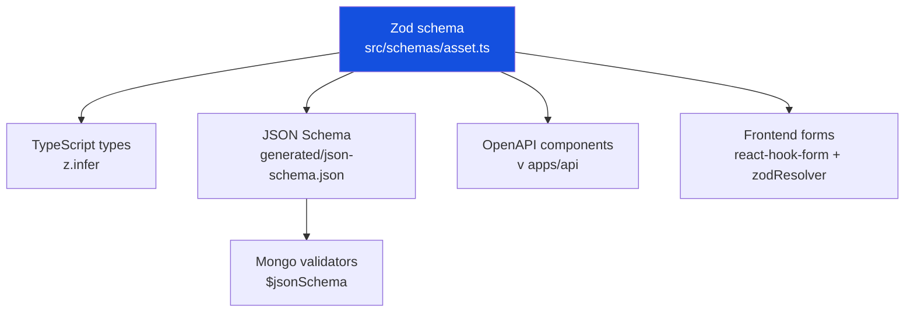

# @sfz/shared-types

> **Single source of truth** pre dátový model SFZ Asset Management.

## Filozofia

Tento balíček rieši **jeden problém**: aby sa typy a validačné pravidlá
nemuseli udržiavať na piatich miestach (DB schema, backend DTO, OpenAPI,
frontend forms, testy).

Riešenie:

1. **Zod schémy** v `src/schemas/` sú **zdrojom pravdy**.
2. **TypeScript typy** sa **odvodzujú** automaticky cez `z.infer<typeof X>`.
3. **JSON Schema** sa **generuje** cez `pnpm generate:json-schema`.
4. **Mongo `$jsonSchema` validátory** sa **generujú** z JSON Schema.
5. **OpenAPI komponenty** sa generujú v `apps/api` cez `zod-to-openapi`.



Týmto spôsobom je nemožné, aby sa dáta v DB nesúhlasili s API alebo s frontendom.

## Štruktúra

```
packages/shared-types/
├── src/
│   ├── enums/              # Pomenované konštanty (stavy, role, kategórie)
│   ├── schemas/            # Zod schémy entít
│   │   ├── common.ts       # Spoločné (ObjectId, Timestamp, AuditFields, ...)
│   │   ├── user.ts         # User + Create/Update/Public variants
│   │   ├── asset.ts        # Asset + IT/Sports/Media specs
│   │   ├── loan.ts         # LoanRequest + Loan + Return
│   │   ├── loan-protocol.ts# Právne relevantné protokoly o odovzdaní
│   │   ├── category.ts     # Hierarchická taxonómia
│   │   ├── location.ts     # Sklady, kancelárie, štadióny
│   │   ├── attachment.ts   # Súbory v object storage
│   │   ├── audit-log.ts    # Nemenný audit log (append-only)
│   │   └── notification.ts # In-app + e-mail notifikácie
│   └── index.ts            # Barrel export
├── scripts/
│   ├── generate-json-schema.ts        # Zod → JSON Schema
│   └── generate-mongo-validators.ts   # JSON Schema → mongosh skript
├── generated/              # Build outputs (gitignored)
│   ├── json-schema.json
│   └── mongo-validators.js
└── tests/
    └── schemas/*.test.ts   # Happy + sad path testy
```

## Použitie

### V backend (NestJS)

```ts
import { AssetSchema, type Asset } from '@sfz/shared-types';

@Post()
async createAsset(@Body() body: unknown): Promise<Asset> {
  // Runtime validácia
  const result = AssetSchema.safeParse(body);
  if (!result.success) {
    throw new BadRequestException(result.error.format());
  }

  // result.data je už plne typovaný ako Asset
  return this.assetService.create(result.data);
}
```

### V frontend (React + react-hook-form)

```tsx
import { CreateAssetSchema, type CreateAssetInput } from '@sfz/shared-types';
import { useForm } from 'react-hook-form';
import { zodResolver } from '@hookform/resolvers/zod';

function CreateAssetForm() {
  const form = useForm<CreateAssetInput>({
    resolver: zodResolver(CreateAssetSchema),
  });
  // ...
}
```

### V Mongo repository

```ts
import jsonSchema from '@sfz/shared-types/json-schema';

// Pri starte aplikácie nastavíme validátory
await db.runCommand({
  collMod: 'assets',
  validator: { $jsonSchema: jsonSchema.definitions.Asset },
  validationLevel: 'strict',
  validationAction: 'error',
});
```

## Pravidlá pre prispievateľov

### Pridanie novej entity

1. Vytvor `src/schemas/<entita>.ts` so Zod schémou.
2. Vyexportuj ju v `src/schemas/index.ts`.
3. Pridaj ju do `SCHEMAS_TO_GENERATE` v `scripts/generate-json-schema.ts`.
4. Pridaj mapovanie v `SCHEMA_TO_COLLECTION` v `scripts/generate-mongo-validators.ts`.
5. Pridaj test v `tests/schemas/<entita>.test.ts` (happy + sad path).
6. Pridaj entitu do `docs/architecture/data-model.md`.

### Konvencie pre Zod schémy

**DO:**

- ✅ Používaj `BaseDocumentSchema.merge(SoftDeleteSchema).extend(...)` pre nové entity.
- ✅ Pre stringy vždy nastav `.min()` a `.max()`.
- ✅ Pridaj `.describe('...')` pre dôležité polia (objaví sa v OpenAPI).
- ✅ Slovenské chybové správy: `.min(1, 'Názov je povinný.')`.
- ✅ Nullable polia explicitne: `.nullable().default(null)`.
- ✅ Enumy zo `src/enums/`, nie inline `z.enum([...])`.

**DON'T:**

- ❌ Nepoužívaj `z.any()` ani `z.unknown()` (okrem `specs` polí, ktoré sú zámerne flexibilné).
- ❌ Nepridávaj polia mimo Zod schémy (žiadne "tieňové" polia priamo v Mongo).
- ❌ Nepoužívaj `.optional()` keď myslíš `.nullable()` — to sú dve rôzne veci.
- ❌ Neimportuj z `apps/*` (shared-types nesmie závisieť na aplikáciách).

### Spätná kompatibilita

Schémy sú API kontrakt. Zmena schémy = breaking change ak:

- Pridávaš povinné pole bez default hodnoty
- Odstraňuješ pole
- Meníš typ existujúceho poľa
- Zužuješ validáciu (napr. `.max(500)` → `.max(200)`)

Pri breaking change:

1. Bump **major** verziu balíčka v `package.json`.
2. Vytvor migračný skript v `apps/api/migrations/`.
3. Spomeň v `CHANGELOG.md`.
4. Otestuj backward compatibility na development MongoDB.

## Scripts

```bash
# Build (kompiluje TS + generuje JSON Schema)
pnpm build

# Watch mode
pnpm dev

# Iba JSON Schema
pnpm generate:json-schema

# Iba Mongo validátory (vyžaduje JSON Schema)
pnpm generate:mongo-validators

# Testy
pnpm test
pnpm test:watch

# Typecheck (bez emit)
pnpm typecheck

# Vymazať build artifacts
pnpm clean
```

## Závislosti

- **zod** `^3.23.8` — runtime validácia + typová inferencia
- **zod-to-json-schema** `^3.23.5` — generovanie JSON Schema

Tento balíček je **runtime dependency** pre `apps/api` aj `apps/web`. Drž ho ľahký
— **nepridávaj** sem nič, čo nesúvisí so schémou.

## Referencie

- [Zod docs](https://zod.dev/)
- [zod-to-json-schema](https://github.com/StefanTerdell/zod-to-json-schema)
- [Mongo $jsonSchema validator](https://www.mongodb.com/docs/manual/reference/operator/query/jsonSchema/)
- [ADR-0005: Mongo Native Driver + Zod](../../docs/decisions/0005-mongo-native-driver.md)
